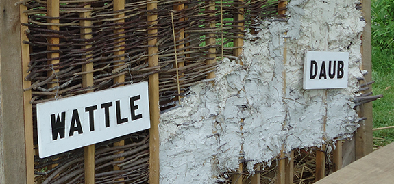

# WADL and Daub

A REST API Processing and Documentation Utility

A Web Application Description Language (WADL)-based API processing and automated
documentation utility. This library includes an WADL processing resource to facilitate
automated documentation of RESTFUL web services.

The Web Application Description Language (WADL) is designed to provide a machine
readable description of HTTP-based Web applications. WADL is basically SOAP WSDL for REST.
The WADL specification is hosted at W3C, and the latest version was published
way back in 31 August 2009: [http://www.w3.org/Submission/wadl/](http://www.w3.org/Submission/wadl/)

A normative XML schema for the WADL vocabulary can be found at
[wadl.xsd](https://www.w3.org/Submission/wadl/wadl.xsd)

## About <small> and justification </small>

Java Jersey does not implements the bare minimum required WADL specification
components. Important components such as _documentation_ are completely omitted,
while other components such as query and response object description would be
useful.

Frameworks such as [Swagger](http://swagger.io) and [RAML](http://raml.org)
have filled this gap by inventing, from whole cloth, new API generation, consuming
and documentation strategies. We think these are useful but superfluous for our needs.
Jackson is just fine, it just needs a decoration.

In this utility we use Jackson to provide a standard WADL file (the "wattle"). We
then enhance the WADL information with supplemental documentation (the "daub")
to provide a complete RESTful API autodocumentation resource. Simple and easy.

This library includes:

1. a complete implementation of the WADL object model
2. a JSF Composite Component to pretty-print WADL methods in HTML
3. a JSF managed bean supporting the composite component

## Basic Usage (the "wattle")

This resource is designed for web applications using Java Server Faces.

1. Add this library as a dependency to your JavaEE 7 web application.

2. In faces-config.xml, add a **link** resource bundle. e.g.:
<pre>
  &lt;resource-bundle&gt;
    &lt;base-name&gt;faces.link&lt;/base-name&gt;
    &lt;var&gt;link&lt;/var&gt;
  &lt;/resource-bundle&gt;</pre>

3. In the link.properties file, add an entry pointing to the WADL file. e.g.
<pre>
  wadl=http://[rest-resource]/application.wadl</pre>

4. In a JSF page, use the WADL component. e.g.
<pre>
  &lt;ui:repeat value="#{wadlBean.findMethods(param['path'])}" var="m"&gt;
    &lt;wadl:method method="#{m}"
              verbose="true"
              collapsible="true"/&gt;
  &lt;/ui:repeat&gt;</pre>

More: Familiarize yourself with the WADL specification then inspect the **WadlBean**
managed bean for more information examples.

## Enhancements (the "Daub")

Java Jackson WADL files presently do not include the **Doc** element, and so are
sorely lacking in useful documentation and labels. Specify your own parameter
descriptions by adding a **labels.xml** properties file in the **META_INF/resources**
directory of your application.

An example **labels.xml** file is included in the **doc/example** directory.

## License = GPL 3.0

Copyright (C) 2017 Key Bridge LLC

This program is free software: you can redistribute it and/or modify
it under the terms of the GNU General Public License as published by
the Free Software Foundation, either version 3 of the License, or
(at your option) any later version.

This program is distributed in the hope that it will be useful,
but WITHOUT ANY WARRANTY; without even the implied warranty of
MERCHANTABILITY or FITNESS FOR A PARTICULAR PURPOSE.  See the
GNU General Public License for more details.

You should have received a copy of the GNU General Public License
along with this program.  If not, see <http://www.gnu.org/licenses/>.

